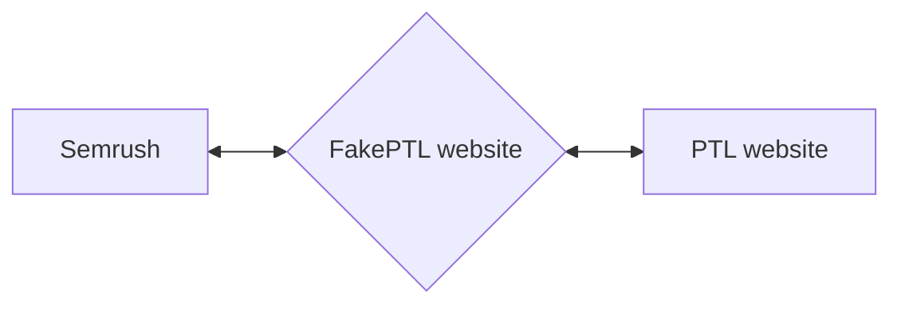
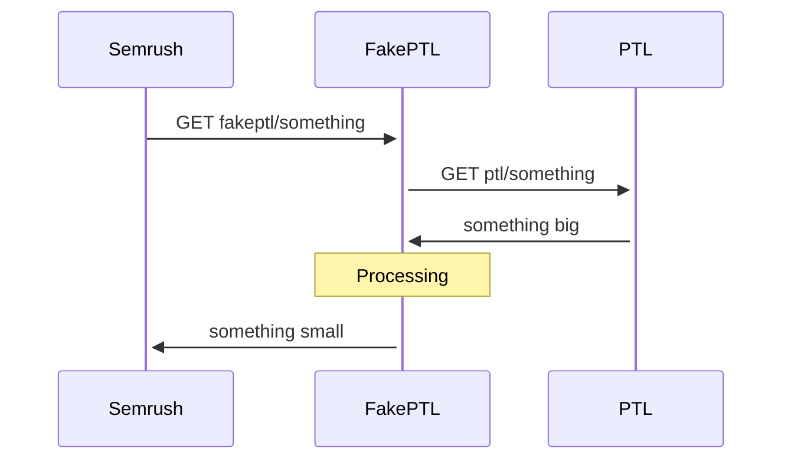

# Fake PTL website

**Fake PTL** is a proxy website for *Semrush* to be able to crawl the *PTL* real website.



Currently, the *Semrush* limitation for crawling *PTL* website is due to the big size of PTL pages. This issue is mainly caused by the WSAIO app that cannot be removed. What **FakePTL** does is to act as a man-in-the-middle, *Semrush* will crawl *FakePTL* and *FakePTL* will return a minified version of *PTL* content, without the WSAIO JavaScript code.



## Configure a VPS for hosting this app
Get an Ubuntu VPS and follow the following steps


1. Update the linux packages list
    ```
    apt -y update
    ```

2. Install required packages
    ```
    apt -y install apache2 php-xml php libapache2-mod-php composer certbot python3-certbot-apache
    ```

3. Enable php mod for apache by creating symlink
    ```
    ln -s /etc/apache2/mods-available/php.load /etc/apache2/mods-enabled/
    ```

4. Request and install SSL certificate from Let's Encrypt
    ```
    certbot --apache -d fake.premiertablelinens.com
    ```

5. Disable apache default Virtual Hosts
    ```
    a2dissite 000-default && a2dissite 000-default-le-ssl
    ```

7. Create new configuration for FakePTL Virtual Host
    ```
    nano /etc/apache2/sites-available/fakeptl.conf
    ```

    Set this as the file content
    ```
    <VirtualHost *:443>
        ServerAdmin afernandez@designcodesolutions.com
        DocumentRoot /var/www/fakeptl/public

        <Directory /var/www/fakeptl/public>
            Options Indexes FollowSymLinks
            AllowOverride All
            Require all granted
        </Directory>

        ErrorLog ${APACHE_LOG_DIR}/error.log
        CustomLog ${APACHE_LOG_DIR}/access.log combined

        ServerName fake.premiertablelinens.com
        SSLCertificateFile /etc/letsencrypt/live/fake.premiertablelinens.com/fullchain.pem
        SSLCertificateKeyFile /etc/letsencrypt/live/fake.premiertablelinens.com/privkey.pem
        Include /etc/letsencrypt/options-ssl-apache.conf
    </VirtualHost>
    ```

8. Set apache ServerName
    ```
    nano /etc/apache2/apache2.conf
    ```

    Add these lines at the end of the file content
    ```
    # Added by Albert
    ServerName fake.premiertablelinens.com
    ```

9. Enable FakePTL Virtual Host
    ```
    a2ensite fakeptl.conf
    ```

10. Reload and restart apache service
    ```
    systemctl reload apache2 && systemctl restart apache2
    ```

## Deployment

To deploy the project, just run this entire concatenation of commands
```
cd /var/www && rm -rf fakeptl && wget https://github.com/Albert-DCS/CleanTagProxy/archive/refs/heads/main.zip && unzip main.zip && mv CleanTagProxy-main fakeptl && rm main.zip && cd fakeptl && composer install --no-dev --optimize-autoloader
```

Now check that everything is working at https://fake.premiertablelinens.com

Remember to have an A DNS record making fake.premiertablelinens.com point to the VPS public IP address.